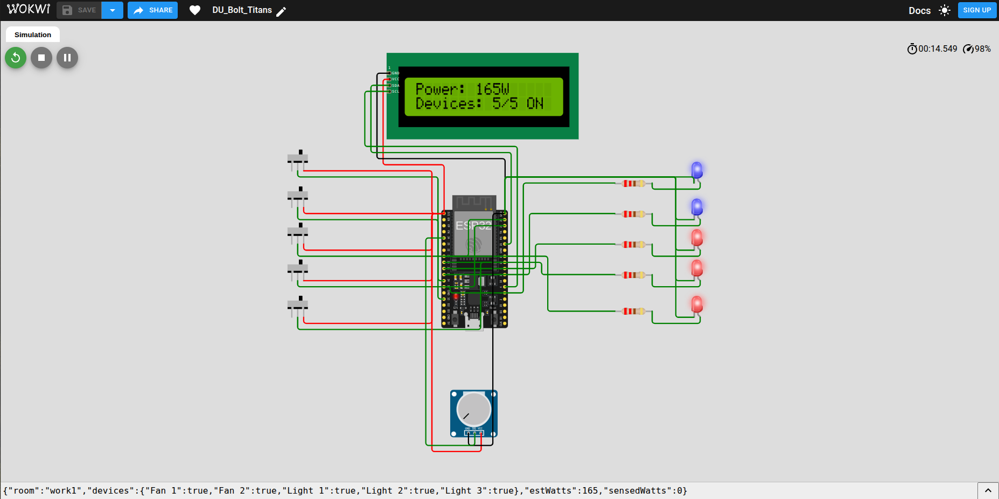
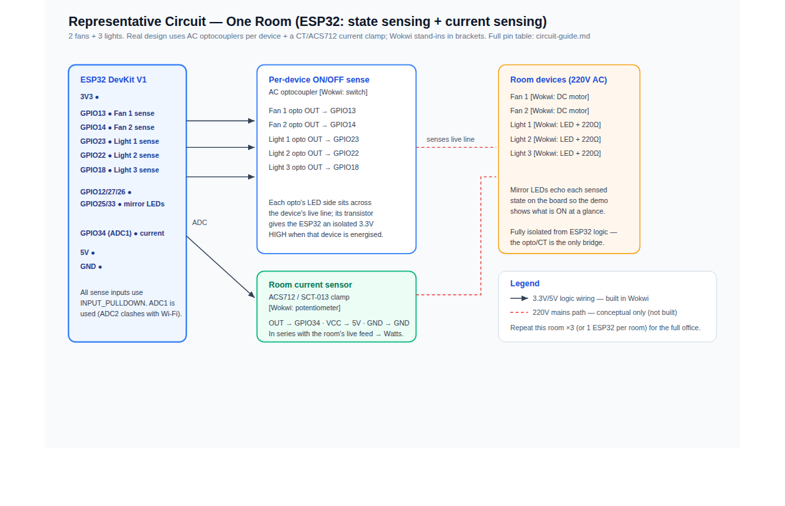

# ⚡ Office Energy Monitor — Lights, Fans & Discord

> Techathon Nationals 2026 · Hackathon (Preliminary Round) · Okkhor Technology / IUT Robotics Society

A monitoring system for a small office where people keep leaving the lights and fans
on. It simulates **15 devices across 3 rooms** (2 fans + 3 lights each) and surfaces their
live state and power usage through **two interfaces that share one backend**:

- a **real-time web dashboard** (React) that updates with no page refresh, and
- a **Discord bot** that answers the boss's questions in plain, friendly language.

Both read from a **single source of truth**, so they can never disagree about reality.

---

## 🎥 Demo & links

| | Link |
|---|---|
| Demo video (≤ 3 min) | _add link_ |
| Live dashboard | **<https://office-energy-monitor.onrender.com>** — one-click deploy in [DEPLOY.md](DEPLOY.md) |
| Wokwi circuit | **<https://wokwi.com/projects/468588825338810369>** — build notes in [circuit-guide.md](diagrams/circuit-guide.md) |


The dashboard is fully responsive and works on phones too:


---

## 1. Problem understanding

The office has **3 rooms** — Drawing Room, Work Room 1, Work Room 2 — each with the same
devices. Devices get left running after hours and the bill climbs unnoticed. The boss
wants to (a) **see every light and fan live**, (b) **check power being burned**, and
(c) **ask a bot from Discord** — all backed by the same data.

> **Device count.** The office layout is **2 fans + 3 lights per room × 3 rooms = 15
> devices total**, matching the floor plan. (The room/device layout lives in one place —
> [`backend/app/config.py`](backend/app/config.py).)

## 2. Architecture

```
[Simulated Device Layer] → [Backend API] → [ Web Dashboard ] && [ Discord Bot ]
```


One **FastAPI** process owns the only copy of device state (`DeviceStore`). A background
**simulator** mutates it over time; an **alert engine** derives anomalies from it. The
state reaches the two clients by two transports:

- **WebSocket (`/ws/live`)** pushes a full snapshot to every dashboard on each tick →
  live updates, no refresh.
- **REST (`/api/*`)** serves the Discord bot on demand.

The bot never keeps its own state — it always asks the backend, which is what guarantees
"both interfaces reflect the same reality".

## 3. Repository structure

```
.
├── backend/            FastAPI shared backend (single source of truth)
│   └── app/
│       ├── config.py      fixed office layout, power ratings, office hours, jitter
│       ├── clock.py       accelerated simulated clock
│       ├── store.py       DeviceStore: 15 devices + energy + continuity + toggle
│       ├── alerts.py      after-hours & room-all-on alert engine
│       ├── simulator.py   asyncio loop that drives the dummy data
│       └── main.py        REST + WebSocket app
├── dashboard/          React + Vite real-time dashboard
│   └── src/
│       ├── components/    KPI cards, floor plan, room panels, power, alerts
│       ├── useLiveState.js  WebSocket subscription (auto-reconnect)
│       └── api.js           REST helper (device toggle)
├── bot/                discord.py bot + Gemini + mock CLI
│   ├── backend_client.py  async REST client
│   ├── formatters.py      accurate factual text (source of numbers)
│   ├── humanizer.py       Gemini rephrasing + graceful fallback
│   ├── handlers.py        shared command logic (Discord + mock CLI)
│   ├── mock_cli.py        local console mode (no Discord token needed)
│   └── bot.py             Discord commands + proactive alert task
├── diagrams/           system diagram + circuit guide + wiring diagram (SVG/PNG)
├── tests/              pytest suite (39 tests, no network/Discord/Gemini)
├── docs/               screenshots (desktop, mobile)
├── run.sh              one-command launcher (backend + dashboard + bot)
└── requirements-dev.txt   pytest for the test suite
```

## 4. Tech stack

| Layer | Tech |
|---|---|
| Backend | Python, **FastAPI**, Uvicorn, native WebSocket |
| Dashboard | **React 18 + Vite**, custom SVG visuals (no page refresh) |
| Bot | **discord.py**, aiohttp |
| AI / LLM | **Google Gemini** (`gemini-2.5-flash`) via `google-genai` |
| Simulation | asyncio background loop + accelerated sim-clock |

---

## 5. Setup & run

**Prerequisites:** Python 3.10+, Node 18+, and (optional) a Discord bot token + Gemini API key.

**Quick start (one command).** After the one-time setup in §5.1–5.3 (venvs + `npm install`), you can launch all three services together:

```bash
./run.sh      # starts backend + dashboard + bot; Ctrl-C stops all
```

Or run the three parts in **three terminals** (backend must be up first):

### 5.1 Backend (start this first)

```bash
cd backend
python -m venv .venv && source .venv/bin/activate   # Windows: .venv\Scripts\activate
pip install -r requirements.txt
cp .env.example .env            # optional: tune SIM_SPEED / SIM_START
uvicorn app.main:app --port 8000
```

- API docs: <http://localhost:8000/docs>
- `SIM_SPEED=60` makes a full office day pass in ~24 real minutes so you can demo
  after-hours behaviour and alerts quickly. Set `SIM_START=16:58` to reach "after hours"
  within seconds.

### 5.2 Dashboard

```bash
cd dashboard
npm install
npm run dev                      # http://localhost:5173
```

The dashboard reads `VITE_API_BASE` (default `http://localhost:8000`).

### 5.3 Discord bot

```bash
cd bot
python -m venv .venv && source .venv/bin/activate
pip install -r requirements.txt
cp .env.example .env             # fill in DISCORD_TOKEN, ALERT_CHANNEL_ID, GEMINI_API_KEY
python bot.py
```

**No Discord token? Test the bot instantly.** If `DISCORD_TOKEN` is unset, `python bot.py`
starts a **local mock CLI** running the *exact same command handlers* the Discord bot uses —
type `!status`, `!room work1`, `!usage`, `!alerts` right in the terminal, and proactive
alerts print there too. Add a token later and the identical logic runs in real Discord.

**Creating the Discord bot:** in the [Discord Developer Portal](https://discord.com/developers/applications)
create an application → **Bot** → copy the token → enable **Message Content Intent** →
invite it to your server with the *Send Messages* + *Read Message History* permissions.
For proactive alerts, enable Developer Mode in Discord and copy the target channel's ID
into `ALERT_CHANNEL_ID`.

> The bot works **without** a Gemini key too — it falls back to clear, friendly factual
> replies. Gemini only makes the wording warmer.

### 5.4 Deploy a live URL (for judging)

**Live now:** <https://office-energy-monitor.onrender.com>

The whole app ships as **one web service** — a Docker image builds the dashboard and
runs the FastAPI backend that serves it, so the dashboard, REST API, and WebSocket share
a single URL (no CORS, `wss://` works automatically). Deploy to **Render's free tier**
straight from this repo via the included [`render.yaml`](render.yaml):

```bash
docker build -t office-energy-monitor . && docker run --rm -p 8000:8000 office-energy-monitor
# → http://localhost:8000  (production image; same as what Render runs)
```

Then point the Discord bot at the deployed backend (`BACKEND_URL=https://…onrender.com`)
so it and the web dashboard read the **same** live state. Full click-by-click steps:
**[DEPLOY.md](DEPLOY.md)**.

> **Free-tier behaviour (important for the demo).** A free Render service **sleeps after
> ~15 min idle** and cold-starts in ~50 s on the next request; the in-memory simulator
> restarts fresh each time (no data to lose). The URL itself stays stable. **Open the link
> once ~1 minute before presenting** so it's warm when judges click. For zero cold-start,
> upgrade to Render's paid Starter plan or add a uptime pinger that hits `/healthz`.

---

## 6. API reference

| Method | Endpoint | Purpose |
|---|---|---|
| GET | `/` | The web dashboard (in a production build); JSON health check at `/healthz` |
| GET | `/api/state` | Full snapshot (devices, rooms, usage, alerts) — the bot's one-stop call |
| GET | `/api/devices?room=<id>` | All devices, optionally filtered by room |
| GET | `/api/rooms` | Per-room summaries |
| GET | `/api/rooms/{room}` | One room (`drawing`, `work1`, `work2`) |
| GET | `/api/usage` | Total watts, per-room watts, today's kWh |
| GET | `/api/alerts` | Active alerts |
| POST | `/api/devices/{id}/toggle` | Manually flip one device (dashboard click) — broadcast to all clients |
| WS | `/ws/live` | Pushes a full snapshot every simulator tick and on any change |

## 7. Discord bot commands

| Command | Does |
|---|---|
| `!status` | On/off summary of every room |
| `!room <name>` | One room — `!room drawing` / `!room work1` / `!room work2` |
| `!usage` | Current total power + today's estimated energy |
| `!alerts` | Active anomalies |
| `!help` | Command list |

Plus a background task that **proactively posts** each newly-triggered alert to the
configured channel (de-duplicated so it never spams).

## 8. AI integration details

- **Model:** `gemini-2.5-flash` via the `google-genai` SDK (thinking disabled for fast,
  complete replies).
- **How it's used:** the bot fetches **real numbers from the backend**, builds an exact
  factual string, and asks Gemini to **reword only the tone** — with an explicit
  instruction *not to change any numbers, room names, or states*. The LLM never invents
  data.
- **Graceful degradation:** any failure (missing key, rate-limit, network) falls back to
  the factual text, so the bot is always correct and always friendly. This is deliberate —
  free-tier Gemini quotas run out, and the demo must never break.
- **Attribution:** conversational responses generated with Google Gemini.

## 9. Simulation & data model

Each device carries: `status` (on/off), `watts` (fan 60 W, light 15 W), `room`,
`last_changed` timestamp, and `last_changed_by`. The simulator:

- flips devices toward a **time-of-day occupancy** (busy 9–5, winding down after),
- **jitters each ON device's wattage ±5%** every tick so the meter reads like a live
  current sensor rather than a constant (`WATT_JITTER_PCT`, set to 0 for exact values),
- **accrues energy** (`Wh += total_watts × Δt`) for today's kWh, resetting at sim-midnight,
- tracks **per-room continuous-on** time for the 2-hour alert.

The dashboard is also **interactive** — click any device to toggle it (`POST /api/devices/{id}/toggle`); the change broadcasts to every client and the bot at once.

Per the brief, the only human names used anywhere are the two provided dummy actors,
**Nafisa Rahman** and **Tanvir Hossain** (shown as "last changed by"). No other names are invented.

## 10. Alerts

| Alert | Condition |
|---|---|
| **After hours** | Any device ON outside office hours (9 AM–5 PM) |
| **Room all-on** | Every device in a room ON continuously for > 2 hours |

Alerts are timestamped, shown live on the dashboard, and pushed to Discord.

## 11. Hardware / circuit

A representative one-room ESP32 schematic (state sensing + current sensing) with full
pin-mapping tables, connection list, and electrical reasoning is in
[`diagrams/circuit-guide.md`](diagrams/circuit-guide.md), with a companion visual wiring
diagram in [`diagrams/circuit-wiring-diagram.svg`](diagrams/circuit-wiring-diagram.svg).

**Built & running in Wokwi:** <https://wokwi.com/projects/468588825338810369> — 5 devices
(2 fans + 3 lights), an I2C LCD reading live power, and a potentiometer standing in for the
current-sensor. All five ON reads **165 W** (`2×60 + 3×15`), matching the simulator exactly.



Reference wiring diagram:



## 12. Running the tests

A pytest suite covers the core logic — device layout, energy accrual, the alert
engine (office-hours and 2-hour boundaries), the simulated clock, and the bot's
factual formatters. No network, Discord, or Gemini calls; it runs in well under a
second.

```bash
pip install -r requirements-dev.txt
pytest
```

```
39 passed in 0.04s
```

---

## 13. Design decisions & trade-offs

- **One in-memory store as the single source of truth.** Both interfaces read from
  `DeviceStore`; nothing else holds state, so the dashboard and bot can never disagree.
  Trade-off: state resets on restart. For 15 devices a database is overkill; to persist,
  swap `DeviceStore`'s internals for SQLite/SQLModel behind the same methods
  (`set_status`, `room_devices`, `usage`) — that's the seam.
- **15 devices (2 fans + 3 lights × 3 rooms).** Matches the office floor plan; the layout is
  one constant in `backend/app/config.py`.
- **Accelerated simulated clock.** Two alert rules are time-based (after-hours,
  on-for-2h). A virtual clock lets a 3-minute demo show a full day and both alerts firing,
  without faking the alerts — they're still computed live from real state.
- **±5 % wattage jitter.** Live readings wobble around the rating so the meter looks like a
  real current sensor, not a constant. Set `WATT_JITTER_PCT=0` for exact values (tests do).
- **The LLM only phrases, never computes.** The bot always pulls real numbers from the
  backend and asks Gemini to reword the tone — with a graceful factual fallback — so replies
  are always correct even when the LLM is missing or rate-limited.
- **Alerts derived on read, aggregated per room.** Alerts are computed from current state
  each request (not stored). We track a true per-room "all-on since" timestamp rather than
  approximating from individual devices, and aggregate to one alert per room to avoid a noisy
  per-device alert flood.
- **Full-snapshot broadcast (not deltas).** Each tick pushes the whole snapshot — trivially
  correct and simple for 15 devices; deltas would be premature optimization here.

---

## Team

Techathon Nationals 2026 — Hackathon (Preliminary Round), IUT Robotics Society.

- Mashfikuzzaman Taeen
- Sara Binte Shafayet
- Salwa Baki
- Raisa Tabassum Payal

## Attributions
- Conversational bot responses: **Google Gemini** (`gemini-2.5-flash`).
- Libraries: FastAPI, Uvicorn, React, Vite, discord.py, google-genai, aiohttp, python-dotenv.
