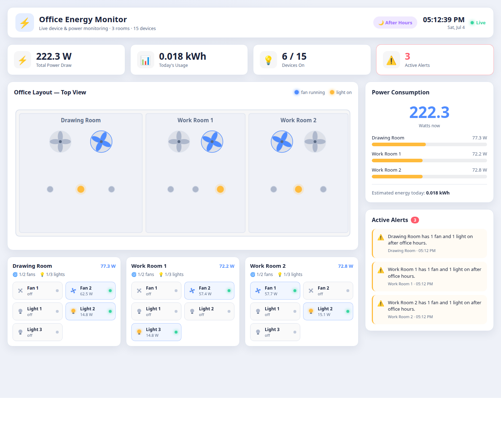
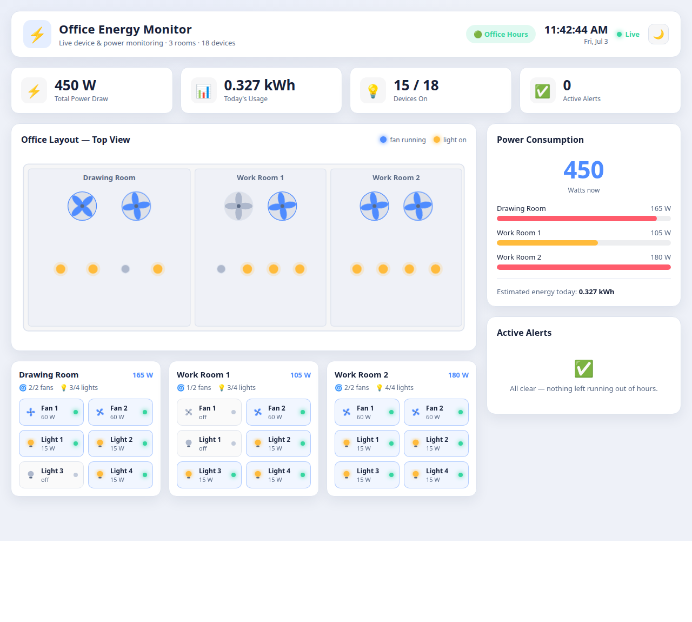
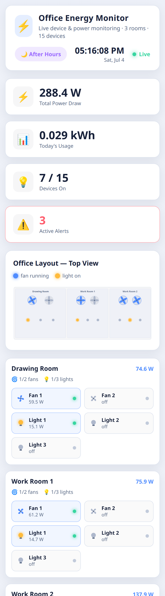
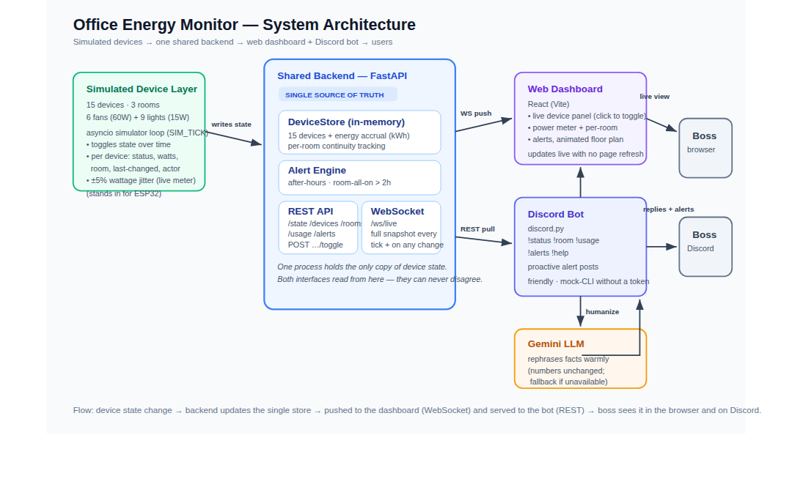

# ⚡ Office Energy Monitor — Lights, Fans & Discord

> Techathon Nationals 2026 · Hackathon (Preliminary Round) · Okkhor Technology / IUT Robotics Society

A monitoring system for a small office where people keep leaving the lights and fans
on. It simulates **18 devices across 3 rooms** and surfaces their live state and power
usage through **two interfaces that share one backend**:

- a **real-time web dashboard** (React) that updates with no page refresh, and
- a **Discord bot** that answers the boss's questions in plain, friendly language.

Both read from a **single source of truth**, so they can never disagree about reality.

---

## 🎥 Demo & links

| | Link |
|---|---|
| Demo video (≤ 3 min) | _add link_ |
| Live dashboard (if deployed) | _add link_ |
| Wokwi circuit | _add link (see `diagrams/circuit-guide.md`)_ |



**Light & dark themes** (toggle in the top bar; remembers your choice and follows your OS preference):



The dashboard is fully responsive and works on phones too:



---

## 1. Problem understanding

The office has **3 rooms** — Drawing Room, Work Room 1, Work Room 2 — each with the same
devices. Devices get left running after hours and the bill climbs unnoticed. The boss
wants to (a) **see every light and fan live**, (b) **check power being burned**, and
(c) **ask a bot from Discord** — all backed by the same data.

> **A note on device count (spec reconciliation).** The brief says "2 fans and 3 lights"
> per room (= 5/room = 15) **but also repeatedly requires "6 devices per room, 18 devices
> total"** and *"the state of all 18 devices"* as a minimum feature. These can't both be
> true. We honour the **hard, repeated requirement of 18 total / 6 per room** using
> **2 fans + 4 lights** per room — this keeps the floor plan's fan count intact and
> satisfies both "6 per room" and "18 total". It is a single constant in
> [`backend/app/config.py`](backend/app/config.py) if the organizers intend 15.

## 2. Architecture

```
[Simulated Device Layer] → [Backend API] → [ Web Dashboard ] && [ Discord Bot ]
```



One **FastAPI** process owns the only copy of device state (`DeviceStore`). A background
**simulator** mutates it over time; an **alert engine** derives anomalies from it. The
state reaches the two clients by two transports:

- **WebSocket (`/ws/live`)** pushes a full snapshot to every dashboard on each tick →
  live updates, no refresh.
- **REST (`/api/*`)** serves the Discord bot on demand.

The bot never keeps its own state — it always asks the backend, which is what guarantees
"both interfaces reflect the same reality".

## 3. Repository structure

```
.
├── backend/            FastAPI shared backend (single source of truth)
│   └── app/
│       ├── config.py      fixed office layout, power ratings, office hours
│       ├── clock.py       accelerated simulated clock
│       ├── store.py       DeviceStore: 18 devices + energy + continuity
│       ├── alerts.py      after-hours & room-all-on alert engine
│       ├── simulator.py   asyncio loop that drives the dummy data
│       └── main.py        REST + WebSocket app
├── dashboard/          React + Vite real-time dashboard
│   └── src/components/    KPI cards, floor plan, room panels, power, alerts
├── bot/                discord.py bot + Gemini humanizer
│   ├── backend_client.py  async REST client
│   ├── formatters.py      accurate factual text (source of numbers)
│   ├── humanizer.py       Gemini rephrasing + graceful fallback
│   └── bot.py             commands + proactive alert task
├── diagrams/           system diagram (SVG/PNG) + circuit build guide
└── docs/               screenshots
```

## 4. Tech stack

| Layer | Tech |
|---|---|
| Backend | Python, **FastAPI**, Uvicorn, native WebSocket |
| Dashboard | **React 18 + Vite**, custom SVG visuals (no page refresh) |
| Bot | **discord.py**, aiohttp |
| AI / LLM | **Google Gemini** (`gemini-2.5-flash`) via `google-genai` |
| Simulation | asyncio background loop + accelerated sim-clock |

---

## 5. Setup & run

**Prerequisites:** Python 3.10+, Node 18+, and (optional) a Discord bot token + Gemini API key.

Run the three parts in **three terminals**. The backend must be up first.

### 5.1 Backend (start this first)

```bash
cd backend
python -m venv .venv && source .venv/bin/activate   # Windows: .venv\Scripts\activate
pip install -r requirements.txt
cp .env.example .env            # optional: tune SIM_SPEED / SIM_START
uvicorn app.main:app --port 8000
```

- API docs: <http://localhost:8000/docs>
- `SIM_SPEED=60` makes a full office day pass in ~24 real minutes so you can demo
  after-hours behaviour and alerts quickly. Set `SIM_START=16:58` to reach "after hours"
  within seconds.

### 5.2 Dashboard

```bash
cd dashboard
npm install
npm run dev                      # http://localhost:5173
```

The dashboard reads `VITE_API_BASE` (default `http://localhost:8000`).

### 5.3 Discord bot

```bash
cd bot
python -m venv .venv && source .venv/bin/activate
pip install -r requirements.txt
cp .env.example .env             # fill in DISCORD_TOKEN, ALERT_CHANNEL_ID, GEMINI_API_KEY
python bot.py
```

**Creating the Discord bot:** in the [Discord Developer Portal](https://discord.com/developers/applications)
create an application → **Bot** → copy the token → enable **Message Content Intent** →
invite it to your server with the *Send Messages* + *Read Message History* permissions.
For proactive alerts, enable Developer Mode in Discord and copy the target channel's ID
into `ALERT_CHANNEL_ID`.

> The bot works **without** a Gemini key too — it falls back to clear, friendly factual
> replies. Gemini only makes the wording warmer.

---

## 6. API reference

| Method | Endpoint | Purpose |
|---|---|---|
| GET | `/` | Health check |
| GET | `/api/state` | Full snapshot (devices, rooms, usage, alerts) — the bot's one-stop call |
| GET | `/api/devices?room=<id>` | All devices, optionally filtered by room |
| GET | `/api/rooms` | Per-room summaries |
| GET | `/api/rooms/{room}` | One room (`drawing`, `work1`, `work2`) |
| GET | `/api/usage` | Total watts, per-room watts, today's kWh |
| GET | `/api/alerts` | Active alerts |
| WS | `/ws/live` | Pushes a full snapshot every simulator tick |

## 7. Discord bot commands

| Command | Does |
|---|---|
| `!status` | On/off summary of every room |
| `!room <name>` | One room — `!room drawing` / `!room work1` / `!room work2` |
| `!usage` | Current total power + today's estimated energy |
| `!alerts` | Active anomalies |
| `!help` | Command list |

Plus a background task that **proactively posts** each newly-triggered alert to the
configured channel (de-duplicated so it never spams).

## 8. AI integration details

- **Model:** `gemini-2.5-flash` via the `google-genai` SDK (thinking disabled for fast,
  complete replies).
- **How it's used:** the bot fetches **real numbers from the backend**, builds an exact
  factual string, and asks Gemini to **reword only the tone** — with an explicit
  instruction *not to change any numbers, room names, or states*. The LLM never invents
  data.
- **Graceful degradation:** any failure (missing key, rate-limit, network) falls back to
  the factual text, so the bot is always correct and always friendly. This is deliberate —
  free-tier Gemini quotas run out, and the demo must never break.
- **Attribution:** conversational responses generated with Google Gemini.

## 9. Simulation & data model

Each device carries: `status` (on/off), `watts` (fan 60 W, light 15 W), `room`,
`last_changed` timestamp, and `last_changed_by`. The simulator:

- flips devices toward a **time-of-day occupancy** (busy 9–5, winding down after),
- **accrues energy** (`Wh += total_watts × Δt`) for today's kWh, resetting at sim-midnight,
- tracks **per-room continuous-on** time for the 2-hour alert.

Per the brief, the only human names used anywhere are the two provided dummy actors,
**Nafisa Rahman** and **Tanvir Hossain** (shown as "last changed by"). No other names are invented.

## 10. Alerts

| Alert | Condition |
|---|---|
| **After hours** | Any device ON outside office hours (9 AM–5 PM) |
| **Room all-on** | Every device in a room ON continuously for > 2 hours |

Alerts are timestamped, shown live on the dashboard, and pushed to Discord.

## 11. Hardware / circuit

A representative one-room ESP32 schematic (state sensing + current sensing) with full
pin-mapping tables, connection list, and electrical reasoning is in
[`diagrams/circuit-guide.md`](diagrams/circuit-guide.md). Build it in Wokwi and add the
screenshot + share link there.

## 12. Running the tests

A pytest suite covers the core logic — device layout, energy accrual, the alert
engine (office-hours and 2-hour boundaries), the simulated clock, and the bot's
factual formatters. No network, Discord, or Gemini calls; it runs in well under a
second.

```bash
pip install -r requirements-dev.txt
pytest
```

```
37 passed in 0.04s
```

---

## Attributions
- Conversational bot responses: **Google Gemini** (`gemini-2.5-flash`).
- Libraries: FastAPI, Uvicorn, React, Vite, discord.py, google-genai, aiohttp, python-dotenv.
